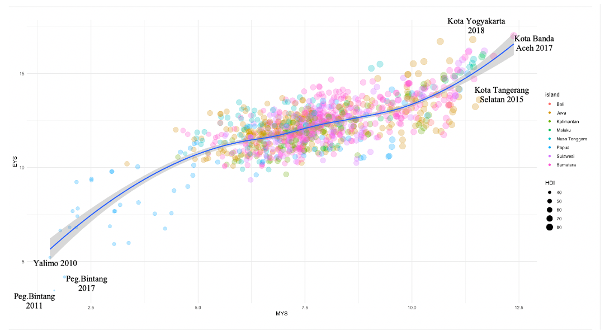
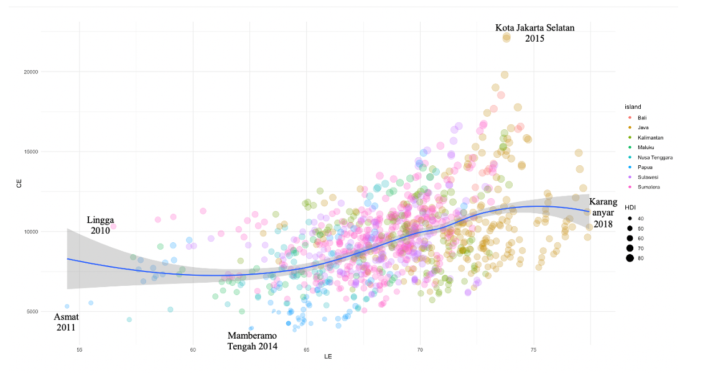
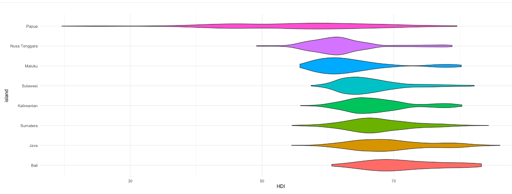
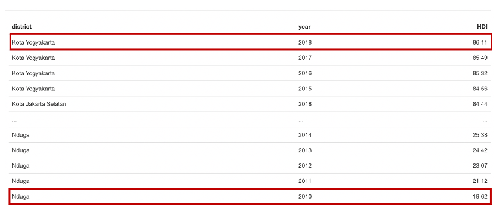
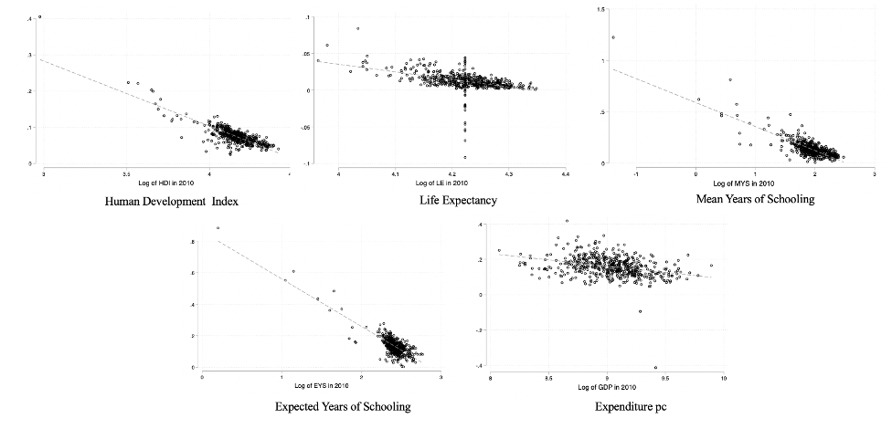
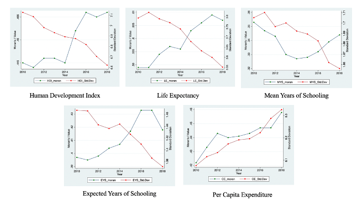
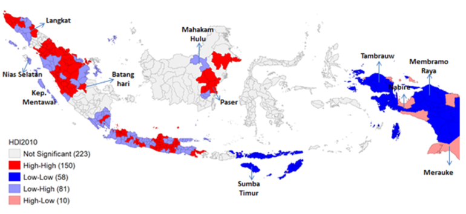
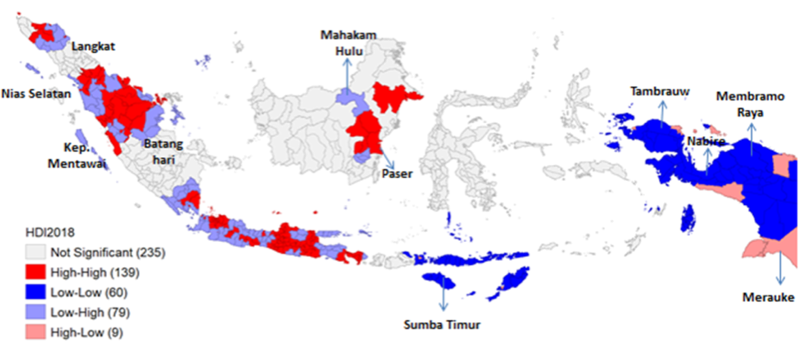

```{r setup, include=FALSE}
options(htmltools.dir.version = FALSE)
```


## Motivation:

-  UNDP reports Indonesia ranked 111 out of 189 countries in 2019.
- The insular geography of Indonesia and its largely unbalanced geographic distribution of natural resources and population
- There are relative few studies that evaluate the role of spatial effects on the
process of regional convergence.
- Scarce academic literature on human development convergence at the district level in Indonesia. 

  
## Research Question:
  
- Does convergence take place on the convergence process of human development across districts in Indonesia?

- To what extent the role of space affects the convergence on human development across Indonesian regions?

  
## Methods:

- Classical convergence framework (Barro and Sala-i-Martin 1992)
- Spatial autocorrelation (Moran's I and LISA)
- Spatial autoregressive models (Spatial Lag and Spatial Error Model)

## Data:

- Human Development Index and its components 2010-2018 at district level 


---

class: middle

## Main Results:

1. **Significant Spatial Autocorrelation** at the district level. 

2. **Regional Convergence** 

  - At district level, convergence is taking place on the growth process of human development and almost all components.

3. **Spatial effects**
  
  - Spatial effects are increasing the speed convergence of human development and its components at the district level.

4. **Policy Implication**

  - Increasing spatially better coordination and cooperation between local governments and authorities in designing development plans.


---

class: middle

# Outline of this presentation

1. **Introduction** and **Data**

2. **Spatial autocorrelation** 

  - Standard Moran's I
  - Local Indicators of Spatial Autocorrelation

3. **Cross-sectional Convergence Model** 
  - Speed of convergence
  - Half-life
    
4. **Cross-sectional Spatial Convergence Model **
  - Spatial dependence test in the residuals
  - Spatial Lag and Spatial Error Coefficient
  - Direct and Indirect Effects

5. **Concluding Remarks**


<br />
<br />
[ Slides and paper available at: https://project2019b.netlify.app ]

---

class: center, middle

# (1) Some stylized facts

**Human development disparity across islands and sitricts over time**

**Socio economic indicators disparities across districts over time**


---

class: middle,center

#Human Development Dispersion over time




---

class: middle,center

#Human Development Dispersion over time


---

class: middle,center

## Human Development Dispersion over time



---

class: middle,center

## Human Development 


## Human Development 

---

class: middle,center

# (1) Data

- Data of human development index and its three dimensions from 514 districts over 2010-2018 period
- The health dimension is represented by a indicator of life expectancy.
- The education dimension is represented by two indicators: literacy rate and mean years of schooling. 
- The decent standard of living dimension is represented by per-capita expenditure.
- All data are derived from National Socio-Economic Survey, conducted by Central Bureau Statistics of Indonesia (BPS-Statistics Indonesia)

---
class: middle

# (2) Convergence framework 

**Sigma Convergence**

**Unconditional beta convergence** 

**Speed of convergence and half-life**


---
class: middle

# Convergence framework (Brief Overview)

## Sigma Convergence

$$\begin{array}{c}
\sigma_{t}=\sqrt{\frac{1}{N-1} \sum_{i=1}^{N}\left(\log \left(y_{i, t}\right)-\overline{\log \left(y_{t}\right)}\right)^{2}} \\
\sigma^{2}=\frac{\sigma_{u}^{2}}{1-e^{-2 \beta}}
\end{array}$$

## Beta Convergence

- The classical unconditional convergence framework of Barro and
Sala-I-Martin (1992),

$$\log \left(\frac{y_{i, t+T}}{y_{i t}}\right)=\gamma-\left(1-e^{-\beta T}\right) \log y_{i t}+\varepsilon_{i}$$
- Based on the speed of convergence (b), a second parameter of interest can
be computed as

$$\text {half-life}=\frac{\log 2}{\beta}$$

---
class: middle, center

# Beta Convergence Scatter Plot



---
class: middle, center
# Convergence results


---
class: middle, center


# (3) Spatial Autocorrelation

Global Spatial Autocorrelation : Moran's I Statistics

Local Indicators of Spatial Autocorrelation (LISA)


---
class: middle, center

# Evolution of Moran's I statistics and standard deviation over 2010-2018 


Notes: Regional disparities (right axis) are measured based on the standard deviation of the log of each variable. Global spatial autocorrelation (left axis) is measured based on the Moran’s I, which is statistically significant at 5% level for all years.

---
class: middle, center

# Local Indicators of Spatial Autocorrelation (LISA)

## Initial period (2010)




---
class: middle, center

# Local Indicators of Spatial Autocorrelation (LISA)

## Final period (2018)


**The East-West dichotomy has been a persistent feature of the Indonesian economy and still present in 2018**

---
class: middle, center

# (4) Cross-sectional Spatial Convergence model

Spatial Lag Model (SLM) and Spatial Error Model (SEM)

Direct and Indirect Effects

Goodness of Fit Test ( AIC and BIC)


---
class: middle, center

# Spatial Lag Model (SLM) and Spatial Error Model (SEM)

**Intuition : Interactions among geographical neighbors can affect the speed of convergence
of the entire regional system**

## Spatial Lag Model

$$\ln \left(\frac{y_{i, t+T}}{y_{i t}}\right)=\gamma-\left(1-e^{-\beta T}\right) \log y_{i t}+\rho \mathbf{W} \ln \left(\frac{y_{i, t+T}}{y_{i t}}\right)+\varepsilon_{i}$$
## Spatial Error Model (SEM)

$$\ln \left(\frac{y_{i, t+T}}{y_{i t}}\right)=\gamma-\left(1-e^{-\beta T}\right) \log y_{i t}+(\mathbf{I}-\lambda \mathbf{W})^{-1} \varepsilon_{i}$$

---

class: middle

# Spatial Error Model (SEM)

$$\ln \left(\frac{y_{i, t+T}}{y_{i t}}\right)=\gamma-\left(1-e^{-\beta T}\right) \log y_{i t}+(\mathbf{I}-\lambda \mathbf{W})^{-1} \varepsilon_{i}$$
---

class: middle

# Spatial Convergence Results


# (5) Concluding Remarks

- **Inequality still matters**. The development gap between the East and West of Indonesia is still persistent.
- Spatial effects are accelerating the pace of convergence at the district level.
- Faster convergence in education-related variables tend to accelerate the speed of convergence of human development.
- 

# Implications and further research

- To spatially filter regional income is important in order to avoid misleading interpretations.
- Call for better coordination of regional policies at the cluster level.
- Enhance inter-regional connectivity and cooperation. 
- Geography matters! breaking spatial barriers and the infrastructure and capabilities required for it must be on top of the policy agenda.
- Next extension: spatial panel data models could be implemented to control for unobserved heterogeneity.


---

class: center, middle

# Thank you very much for your attention


Slides and working paper available at: https://project2019b.netlify.app]


**Quantitative Regional and Computational Science lab**

https://quarcs-lab.rbind.io

***


